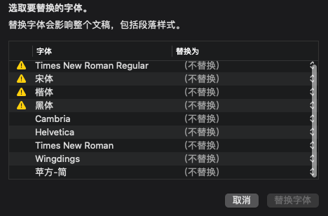

I came across a issue when opening a `doc` file in macOS (12.5.1).

Pages keeps reming me that fonts are missing despite I have already installed
them from file.

It turns out that the Family name in font is not Chinese, which somehow makes 
the Pages.app can not recognize the fonts.

Weird.

If the languages for pages.app is set to Chinese, then Family name changes 
from SimSun to 宋体.

Still it reminds that Fonts are missing despite I have "宋体" in the menu.

It should be noted that Times New Roman Regular was found Missing:

Although under both Chinese and English settings, this font is present.

Is it possible the additional "Regular" is causing issues???

Ref:

[Win-Fonts-For-Mac/Fonts/用于Office的微软雅黑ttf文件 at main · BronyaCat/Win-Fonts-For-Mac](https://github.com/BronyaCat/Win-Fonts-For-Mac)

[system-fonts/os-chinese-fonts.md at master · keqingrong/system-fonts](https://github.com/keqingrong/system-fonts/blob/master/docs/os-chinese-fonts.md)

[scp_zh/fonts at master · StellarCN/scp_zh](https://github.com/StellarCN/scp_zh/tree/master/fonts)

[Haixing-Hu/latex-chinese-fonts: Simplified Chinese fonts for the LaTeX typesetting.](https://github.com/Haixing-Hu/latex-chinese-fonts)

[英文版 Mac 上 office 的中文字体 - 简书](https://www.jianshu.com/p/8cf09c5144e2)

[一年后，再提英文版下中文字体不能正常显示中文名称的问题 - Microsoft Community](https://answers.microsoft.com/zh-hans/msoffice/forum/all/%E4%B8%80%E5%B9%B4%E5%90%8E%E5%86%8D%E6%8F%90/b679b9b5-5aef-45b7-a12c-277ee955117d)

[office 365 word 所有中文字体变成英文。 - Microsoft Community](https://answers.microsoft.com/zh-hans/msoffice/forum/all/office-365-word/2808fe89-04ea-472a-a656-62897916c5eb)

[office中，字体名称全部变成了英文，例如“宋体”变成了“SimSun&# - Microsoft Community](https://answers.microsoft.com/zh-hans/msoffice/forum/all/office%E4%B8%AD%E5%AD%97%E4%BD%93%E5%90%8D/87b26b57-8913-460c-9194-41f2b8090078)
