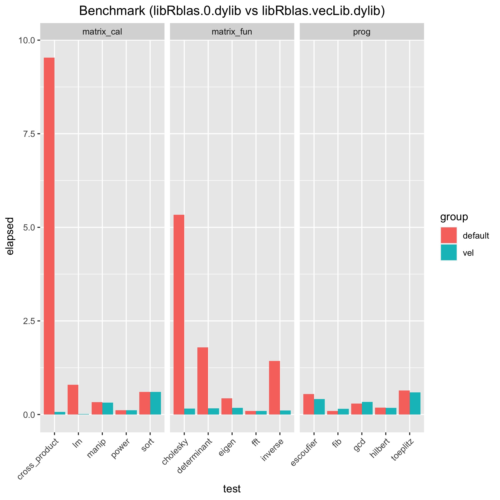

## Why

Version control on R has always been a hassle for me personally since most of the bioinformatics tools or workflows relies too heavily on RMD or Notebook-like script due to its high flexibility. Despite its convenience in parameters tuning and data manipulation, it's much more difficult than sharing the list of python packages in other workflows.

## Existing solution

Someone used Anaconda environment file but I personally find that a bit too clumsy. I never tried it but I assume if one put `R==4.1/4.2` in `env.yml`, conda will try to download and install a different version inside each env directory.

However, this approach might be a lot more useful if a workflow involves a lot of cli tools such as `bwa` of different version or self-compiled one. Keeping everything isolated definitely make things easier.

stackoverflow discussion: https://stackoverflow.com/questions/62187736/creating-an-r-environment-using-anaconda

## R-specific approach

As shown in [this post](https://mp.weixin.qq.com/s/BsEm76Eq9_tbw3myobD_SA?), RStudio became so successful to a point that it's synonymous with R even though it can run in IDE or vim.

Previously, what I experienced and interacted with R is mostly through RStudio but it might be better to explore more options to gain a better understanding of the packages installation, distribution and version control which is extremely important in real-world application where legacy packages are involved. 

### Where is R and its packages

On my personal computer, R can be installed from a version compiled by homebrew (`brew install r`) or r-project one (`brew install --cask r`). Later is preferred but I couldn't find the references now.

`renv` or `Packrat` are manager that are trying to mimic the functionality of `python virtual enviroments` without user-specific custom directories for each different versions of R packages, which requires too many user-defined path and custom env.

ORC provides a great post on [managing R Packages](http://wiki.orc.gmu.edu/mkdocs/How_to_manage_R_packages/) and [renv basics](http://wiki.orc.gmu.edu/mkdocs/How_to_manage_R_packages/#renv-basic-operation).

### Error with R dependency when compiling is required (Apple Silicon)

This is specific to Apple silicon Macs, an experimental build of GNU Fortran compiler is required otherwise errors like these would pop up during installation:

```error
ld: warning: directory not found for option '-L/opt/R/arm64/gfortran/lib/gcc/aarch64-apple-darwin20.6.0/12.0.1'
```

This is due to [no Fortran compiler](https://support.bioconductor.org/p/9138121/) and it can be solved with a experimental build.

```bash
# for R>=4.2.0
curl -O https://mac.r-project.org/tools/gfortran-12.0.1-20220312-is-darwin20-arm64.tar.xz

# unpack
sudo tar fxz gfortran-12.0.1-20220312-is-darwin20-arm64.tar.xz -C /

# /opt/R/arm64/gfortran/SDK has to point to your macOS SDK
sudo gfortran-update-sdk
```

Details here: https://mac.r-project.org/tools/

## Compilers, openMP, etc

Following the guide: https://pat-s.me/transitioning-from-x86-to-arm64-on-macos-experiences-of-an-r-user/#virtual-machines--parallels

`gcc, llvm, openmp` needs to be installed.

To my surprise, the `~/.R/Makevars` is not present after installation.

Now it's my config in `~/.R/Makevars`:

```shell
# homebrew
FLIBS   =-L/opt/homebrew/opt/gfortran/lib
F77     = /opt/homebrew/bin/gfortran
FC      = /opt/homebrew/bin/gfortran

CFLAGS   = -I/opt/homebrew/include
CPPFLAGS = -I/opt/homebrew/include
CXXFLAGS = -I/opt/homebrew/include

# opemmp support
LDFLAGS += -L/opt/homebrew/opt/libomp/lib -lomp
CPPFLAGS += -Xclang -fopenmp
```

### Speeding up by replacing the BLAS lib

[Here](https://www.mail-archive.com/r-sig-mac@r-project.org/msg06199.html)'s a post about matrix manipulation by new BLAS lib:

```shell
# create a symbolic link pointing libRblas.dylib to the optimized BLAS implementation
cd /Library/Frameworks/R.framework/Resources/lib/
ln -s -i -v libRblas.vecLib.dylib libRblas.dylib

# If you ever want to revert this, do
cd /Library/Frameworks/R.framework/Resources/lib/
ln -s -i -v libRblas.0.dylib libRblas.dylib
```

In my test, using `benchmarkme` in [plot_benchmark_BLAS.R](plot_benchmark_BLAS.R), it does improves significantly:



Original csv:
* [`libRblas.vecLib.dylib`](benchmark_vel_BLAS.csv)
* [`libRblas.0.dylib`](benchmark_default_BLAS.csv)